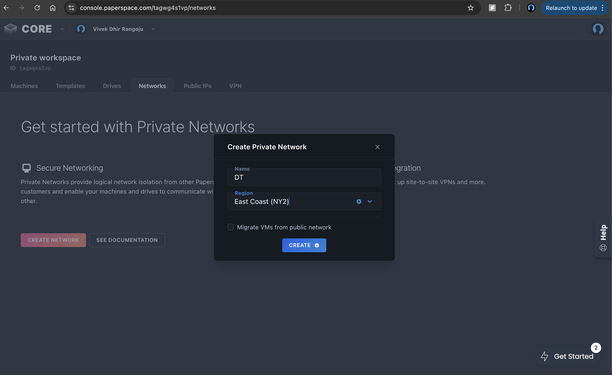
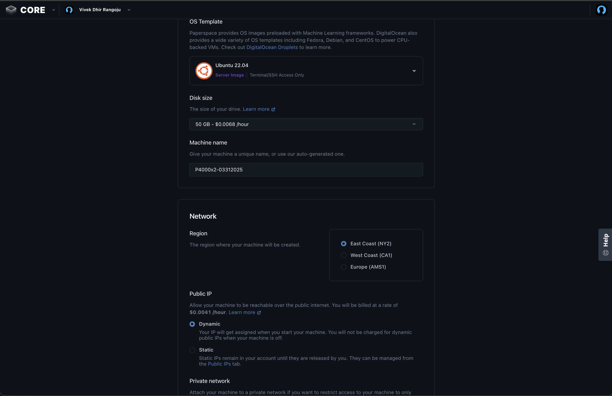
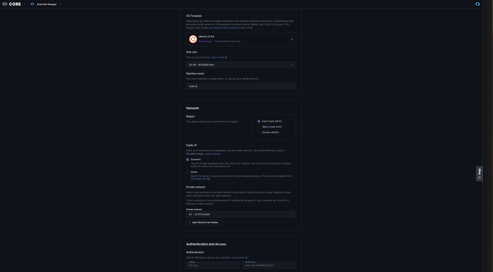
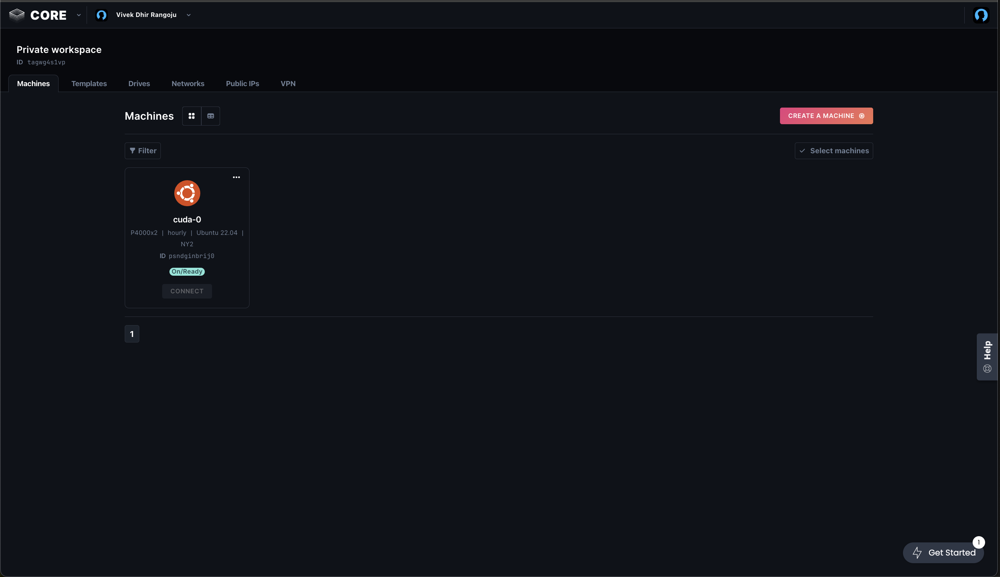
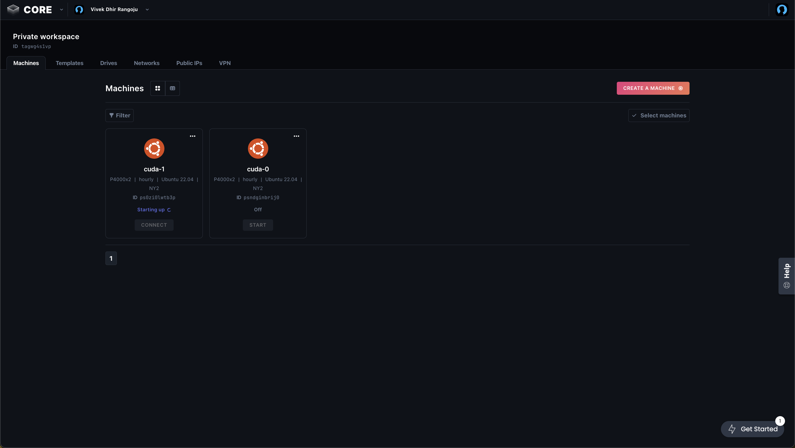
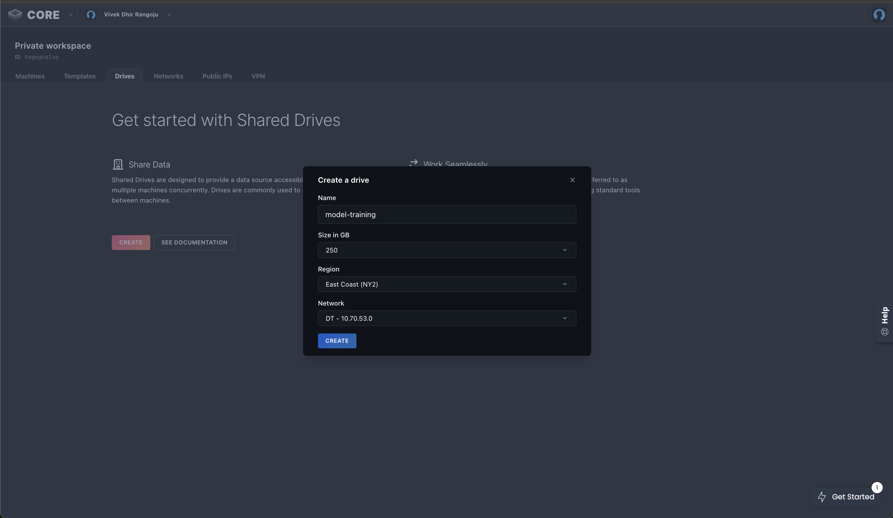
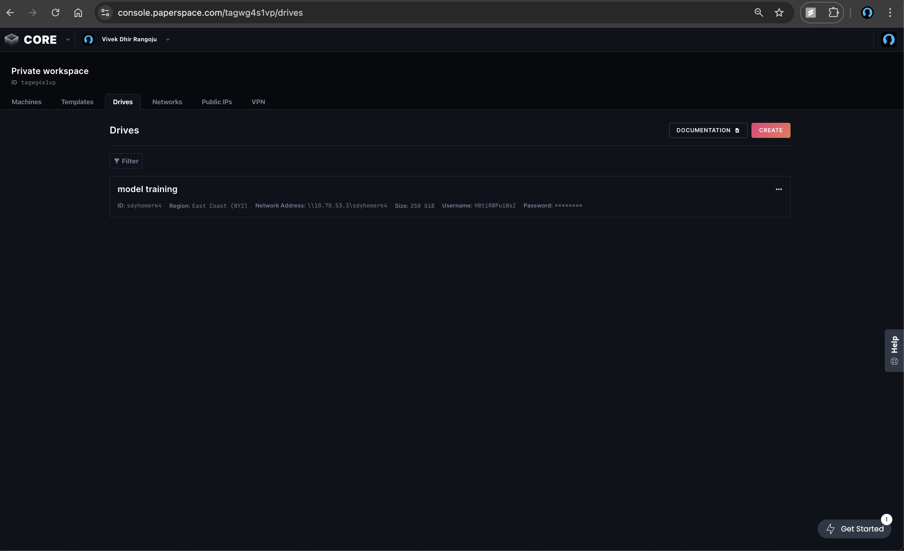
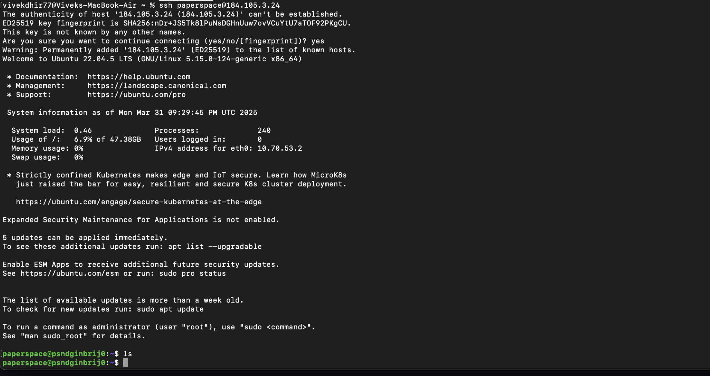
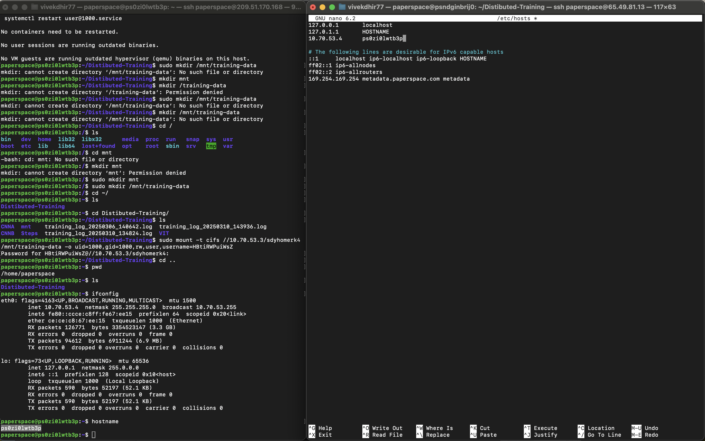
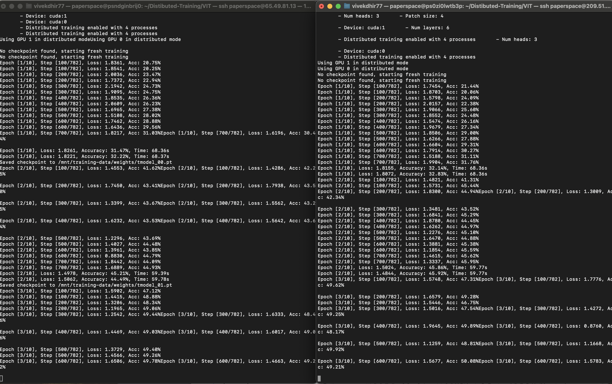

# File Structure
 - ./CNNA (Simple CNN)
    - main_cnnA.py - has the architecture to train CNN-A on CIFAR 10 dataset
 - ./CNNB (Deep CNN)
    - main_cnnB.py - has the architecture to train CNN-A on CIFAR 10 dataset
 - ./VIT
    - train.py - has the architecture to train Vision Transformer on CIFAR 10 dataset

 - The text files have the following formatting in file name:
   xx_yy_z_a.txt
   - xx - batch size
   - yy - number of epochs
   - z - number of nodes
   - a - number of GPUs

# steps 
0. For this project we are using paperspace (https://console.paperspace.com/) to build our infrastructure for singe node single GPU, single node multi GPU, multi node multi GPU setups. We are using NVIDIA Quadro P4000 as GPU.

1. create a private network (We are calling it DT)




2. create a machine with single node single/multi GPU with ML in box as operating system and with the following configurations in the images given below(Here I am choosing single node and two p4000)
 - choose a 






3. (If you are doing multi-node multi-GPU setup) create an other machine with the same direction as in step 2.


4.  Create one network drive (250 GB).
 - Go to drives -> create 
 
 


5. Login on each machine using SSH.
 

6. Perform the following operations on each machine
- `sudo apt-get update` 
- `sudo apt-get install net-tools`
- Get each machine's private IP address using `ifconfig`
- Add IP and hostname mapping of all the slave nodes on `/etc/hosts` file of the master node

7. Mount the network drive
- `sudo apt-get install smbclient`
- `sudo apt-get install cifs-utils`
- `sudo mkdir /mnt/training-data`
  - Replace the following values on the command below:
  - `NETWORD_DRIVE_IP` with the IP address of the network drive
  - `NETWORK_SHARE_NAME` with the name of the network share
  - `DRIVE_USERNAME` with the username of the network drive
  - `sudo mount -t cifs //NETWORD_DRIVE_IP/NETWORK_SHARE_NAME /mnt/training-data -o uid=1000,gid=1000,rw,user,username=NETWORK_DRIVE_USERNAME` 
  - Type the drive's password when prompted


    - `sudo mount -t cifs //10.70.53.3/sdyhomerk4 /mnt/training-data -o uid=1000,gid=1000,rw,user,username=HBtiRWPuiWsZ` In our case the above is the command
 


8. Edit the host files on the machine by adding the IP address of the node along with host name. 
 

9. Install necesary nvidia drivers
 - sudo apt install nvidia-driver-550 nvidia-utils-550
 - sudo reboot


10. Clone the repo.
 - `git clone https://github.com/vivekdhir77/Distibuted-Training`
 - navigate the architecture you want to run.


8. Distributed training:
 


## Setup Options

### 1. Single Node, Single GPU

Run on a single machine with a single GPU:

```bash
# For CNN Model A
python CNNA/main_cnnA.py --model_folder "./weights"

# For CNN Model B
python CNNB/main_cnnB.py --model_folder "./weights"

# For Vision Transformer
python VIT/train.py --model_folder "./weights"
```

### 2. Single Node, Multi-GPU

Run on a single machine with multiple GPUs:

`mkdir -p ./weights`

```bash
# For CNN Model A (using 2 GPUs)
torchrun --nproc_per_node=2 --nnodes=1 CNNA/main_cnnA.py --model_folder "./weights"

# For CNN Model B (using 2 GPUs)
torchrun --nproc_per_node=2 --nnodes=1 CNNB/main_cnnB.py --model_folder "./weights"

# For Vision Transformer (using 2 GPUs)
torchrun --nproc_per_node=2 --nnodes=1 VIT/train.py --model_folder "./weights"
```

### 3. Multi-Node, Multi-GPU

Run on multiple machines, each with multiple GPUs. In this example, we use 2 nodes with 2 GPUs each:

#### On first machine (Master node, e.g. 10.70.53.2):

```bash
# For CNN Model A
torchrun \
  --nproc_per_node=2 \
  --nnodes=2 \
  --node_rank=0 \
  --master_addr="10.70.53.2" \
  --master_port=29500 \
  CNNA/main_cnnA.py --model_folder "/mnt/training-data/weights"

# For CNN Model B
torchrun \
  --nproc_per_node=2 \
  --nnodes=2 \
  --node_rank=0 \
  --master_addr="10.70.53.2" \
  --master_port=29500 \
  CNNB/main_cnnB.py --model_folder "/mnt/training-data/weights"

# For Vision Transformer
torchrun \
  --nproc_per_node=2 \
  --nnodes=2 \
  --node_rank=0 \
  --master_addr="10.70.53.2" \
  --master_port=29500 \
  VIT/train.py --model_folder "/mnt/training-data/weights"
```

#### On second machine (Worker node, e.g. 10.70.53.4):

```bash
# For CNN Model A
torchrun \
  --nproc_per_node=2 \
  --nnodes=2 \
  --node_rank=1 \
  --master_addr="10.70.53.2" \
  --master_port=29500 \
  CNNA/main_cnnA.py --model_folder "/mnt/training-data/weights"

# For CNN Model B
torchrun \
  --nproc_per_node=2 \
  --nnodes=2 \
  --node_rank=1 \
  --master_addr="10.70.53.2" \
  --master_port=29500 \
  CNNB/main_cnnB.py --model_folder "/mnt/training-data/weights"

# For Vision Transformer
torchrun \
  --nproc_per_node=2 \
  --nnodes=2 \
  --node_rank=1 \
  --master_addr="10.70.53.2" \
  --master_port=29500 \
  VIT/train.py --model_folder "/mnt/training-data/weights"
```

## Important Notes:

1. For multi-node setup, launch the command on the master node first, then quickly launch on worker nodes.
2. Ensure all machines can access their respective data and weights directories.
3. For local storage, use `./weights` instead of `/mnt/training-data/weights` instead of .
4. If using shared storage, ensure proper permissions with:
   ```bash
   sudo mkdir -p /mnt/training-data/weights
   sudo chmod 777 /mnt/training-data/weights
   ```
5. The master_addr should be the IP address of the master node.
6. All nodes must be able to communicate with each other on the specified port (29500).

## Troubleshooting

If you encounter training issues it can possiblity be because of following (The following were some frequent issues we ran into):

1. **Training hangs**: This could be related to network connectivity. Make sure all nodes can communicate with each other.

2. **Permission issues**: Ensure proper filesystem permissions for all directories.

3. **CUDA errors**: Make sure you have compatible CUDA drivers installed:
   ```bash
   nvidia-smi
   ```